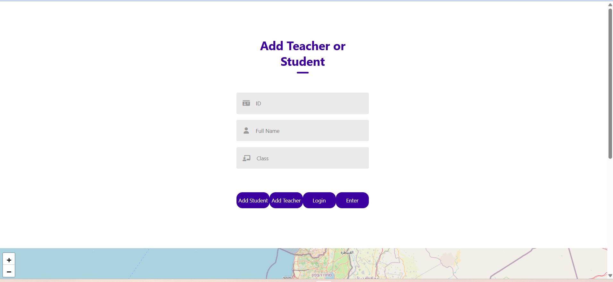
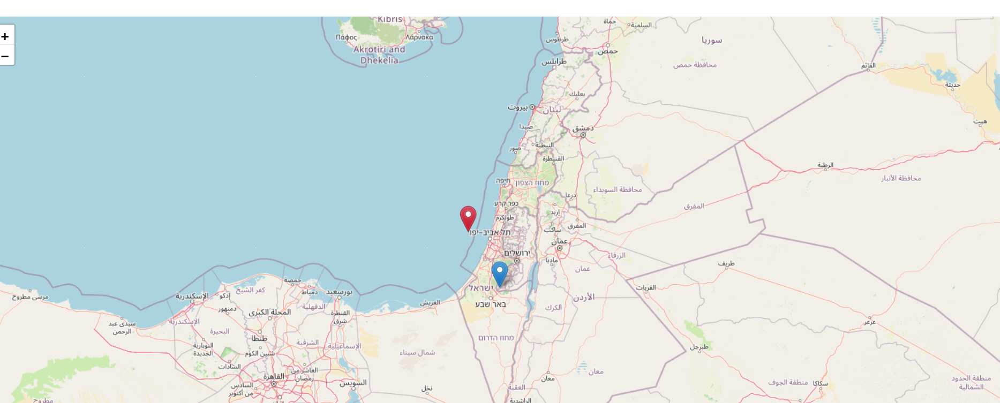
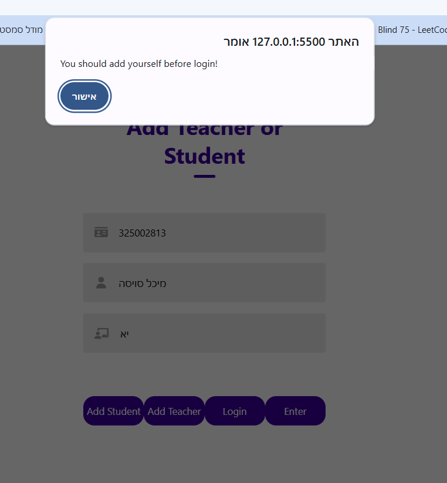
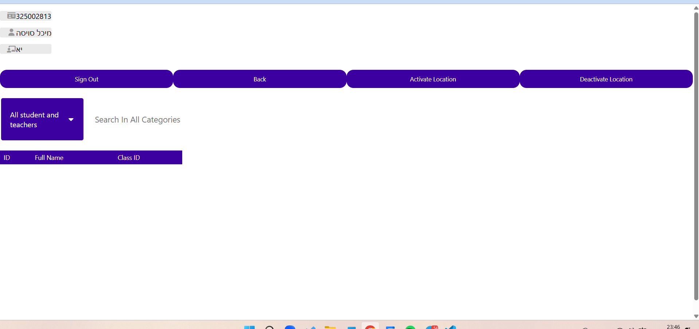
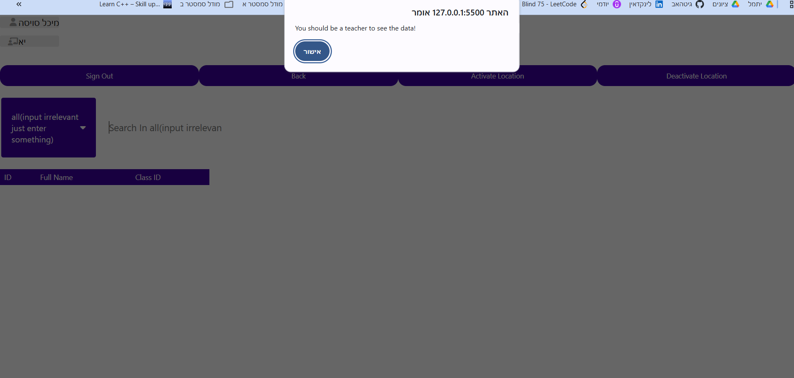
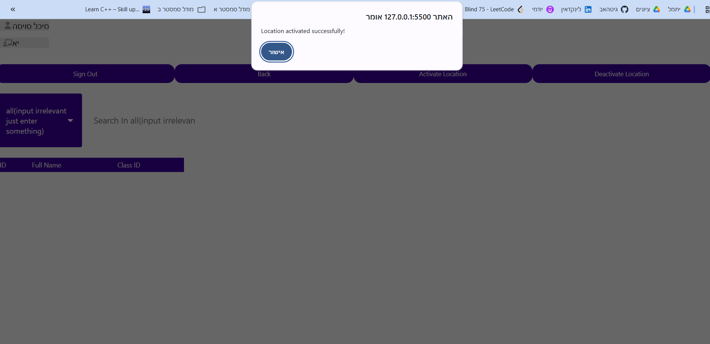
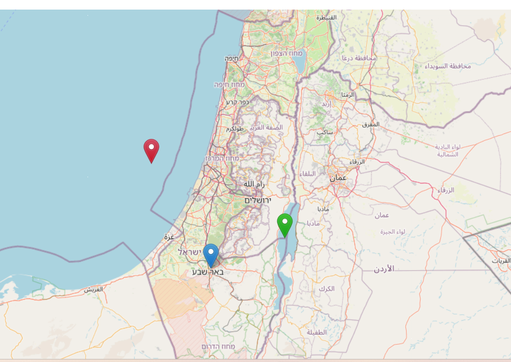
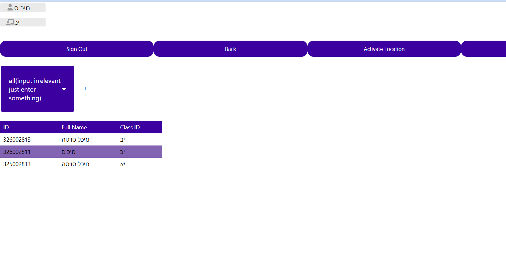
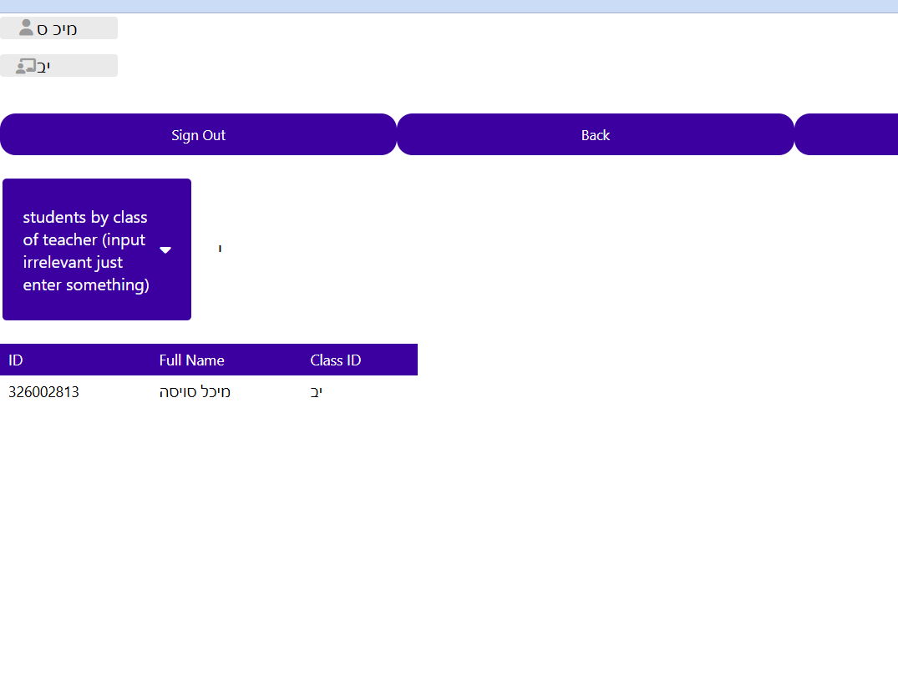
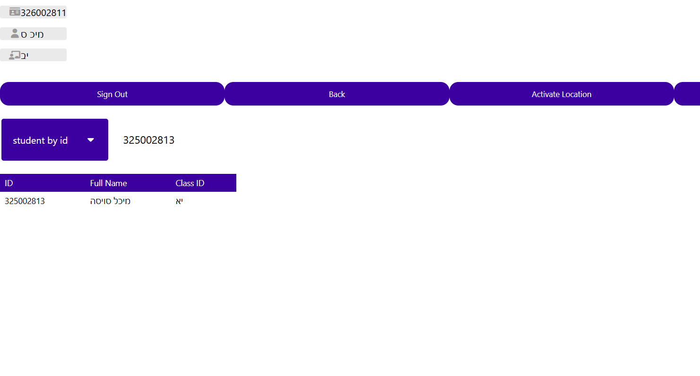

# Trip Management System
### Signing up follow
##### The system allow students and teachers to sign themselves and allows teachers to see who signed up

### Activate the system:
#### 1. Clone the repository
#### 2. create acount in supa base
#### 3. create tables:
######      - "Users" with columns id(int), full_name(text), class_id(text), role(text)
######      - "Locations" with columns id(int), lat(float), lon(float)
#### 4. create .env file with your details
#### 5. Open cmd and enter backend folder, then run "uvicorn main:app --reload"
#### 6. Open cmd and enter frontend folder, then run "python -m http.server 5500"
#### 7. use the web

### Note:
#### If I understand correctly, a teacher is supposed to be able to detect if her student is far from her. If that is indeed the case, my implementation of the bonus is partial. I implemented that if there is a student who is far from her teacher, she is in red, but there is no display that links a student to her group. I think it's just a bit more playing with the fields, but I'm afraid of delaying the submission, so I'm leaving it partial.

#### colors - green - near teacher or has no teacher, red - not around teacher , blue - teacher

## Screenshots

